## 计算机毕业设计Python+Flask弹幕情感分析 B站视频数据可视化 B站爬虫 机器学习 深度学习 人工智能 NLP文本分类 数据可视化 大数据毕业设计 Hadoop PySpark 机器学习 深度学习 Python Scrapy分布式爬虫 机器学习 大数据毕业设计 数据仓库 大数据毕业设计 文本分类 LSTM情感分析 大数据毕业设计 知识图谱 大数据毕业设计 预测系统 实时计算 离线计算 数据仓库 人工智能 神经网络

## 要求
### 源码有偿！一套(论文 PPT 源码+sql脚本+教程)

### 
### 加好友前帮忙start一下，并备注github有偿纯pythonB站分析
### 我的QQ号是2827724252或者798059319或者 1679232425或者微信:bysj2023nb 或bysj1688

# 

### 加qq好友说明（被部分 网友整得心力交瘁）：
    1.加好友务必按照格式备注
    2.避免浪费各自的时间！
    3.当“客服”不容易，repo 主是体面人，不爆粗，性格好，文明人。

演示视频

https://www.bilibili.com/video/BV1Yz421z7mh/?spm_id_from=333.999.0.0

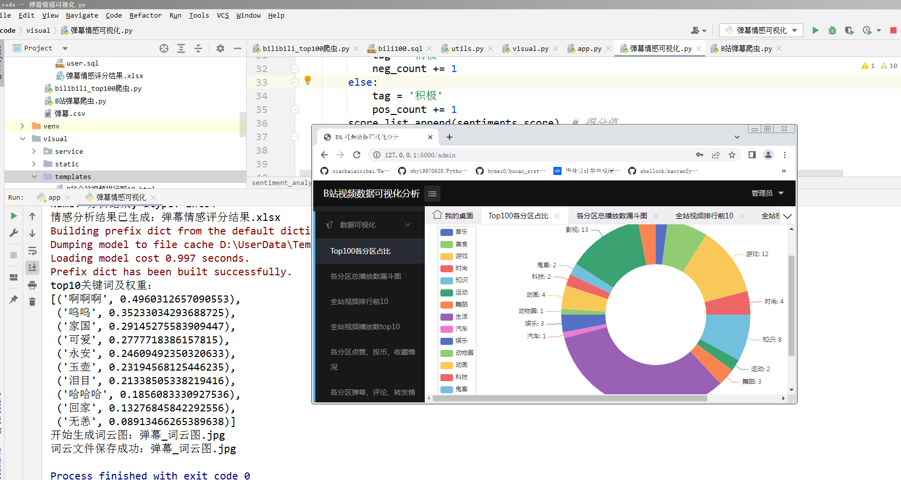
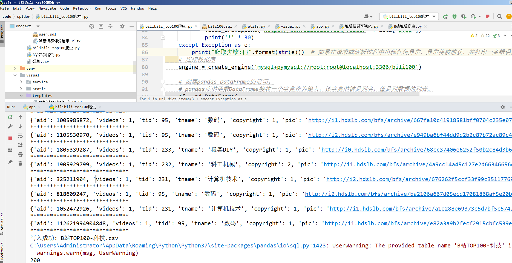
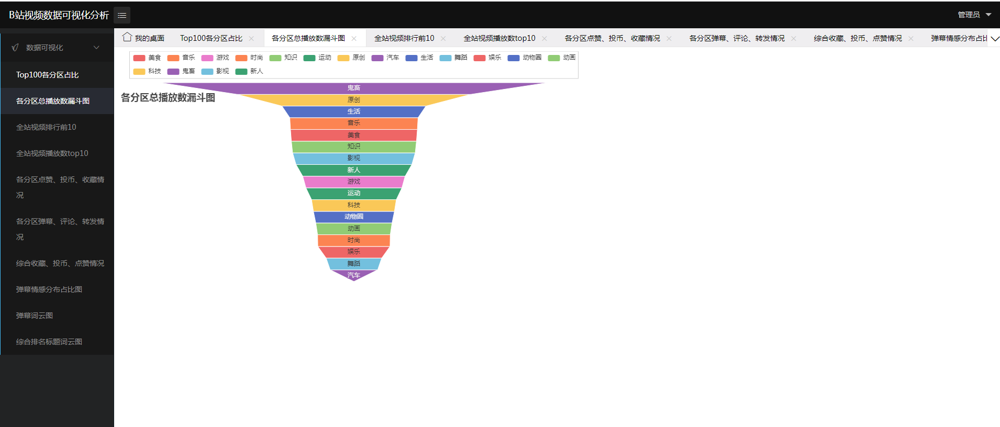
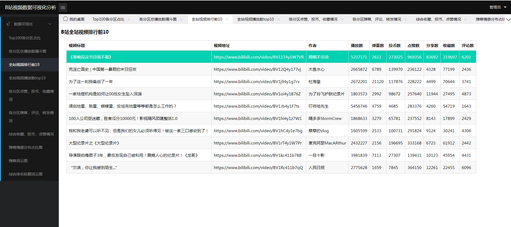
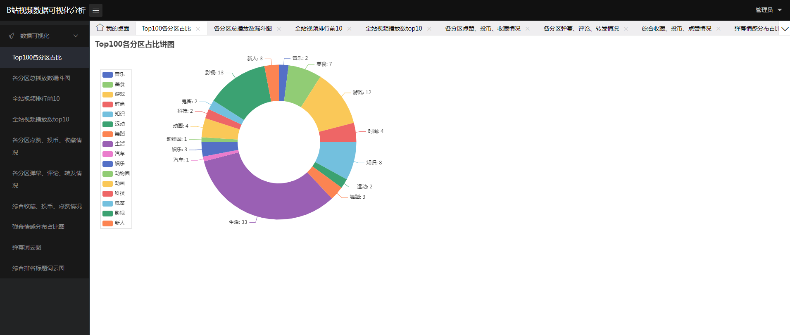
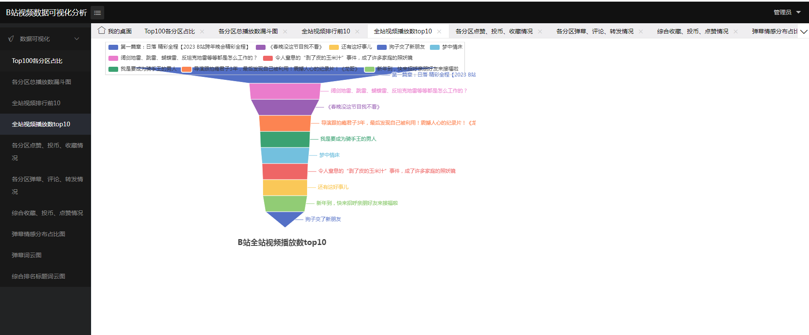
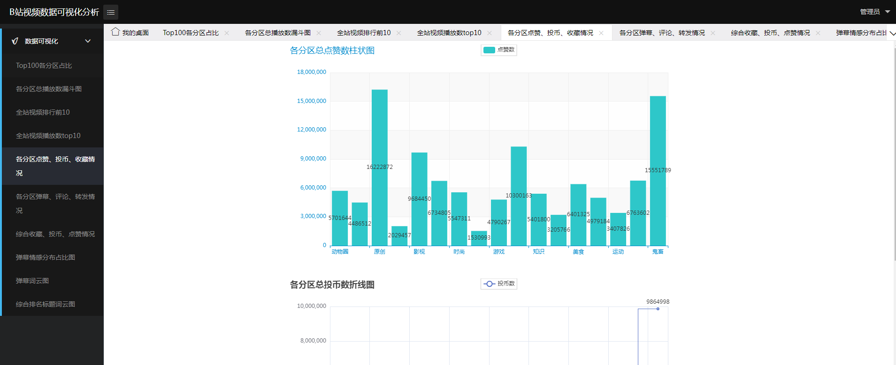
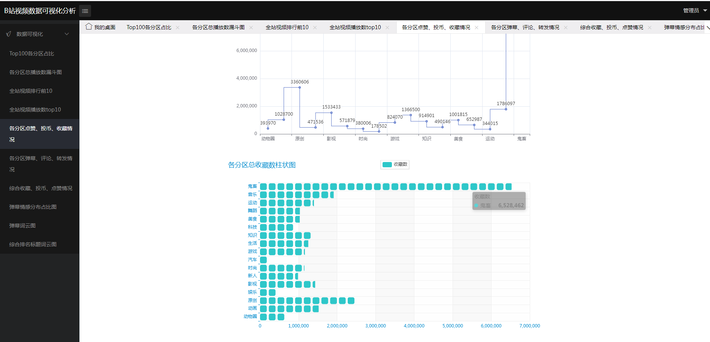
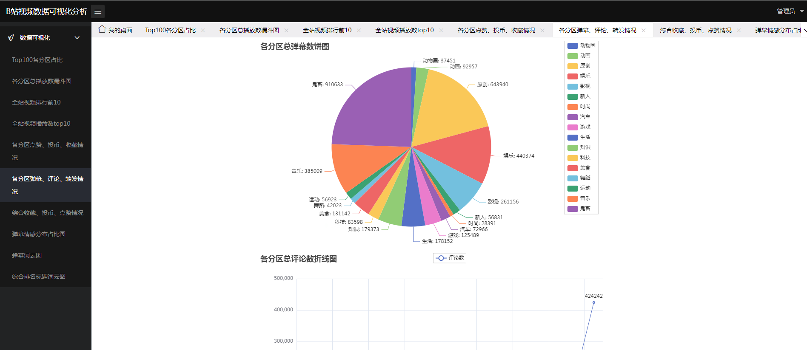
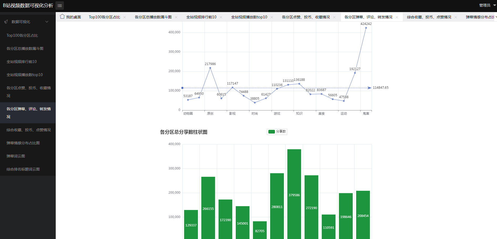
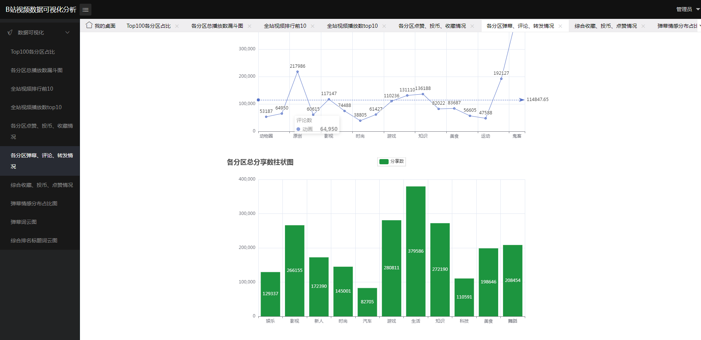
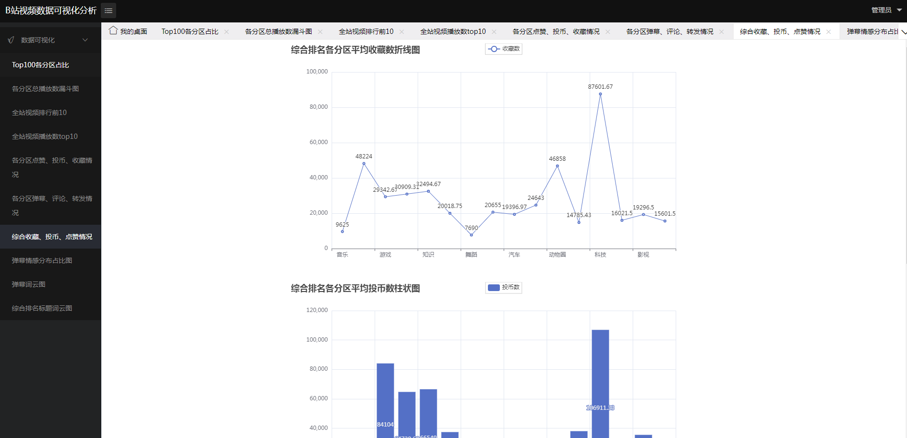
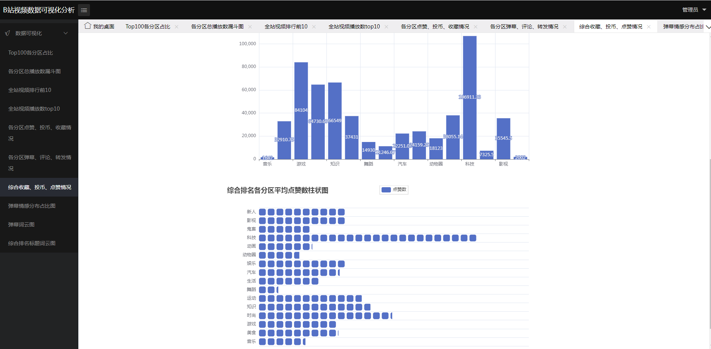
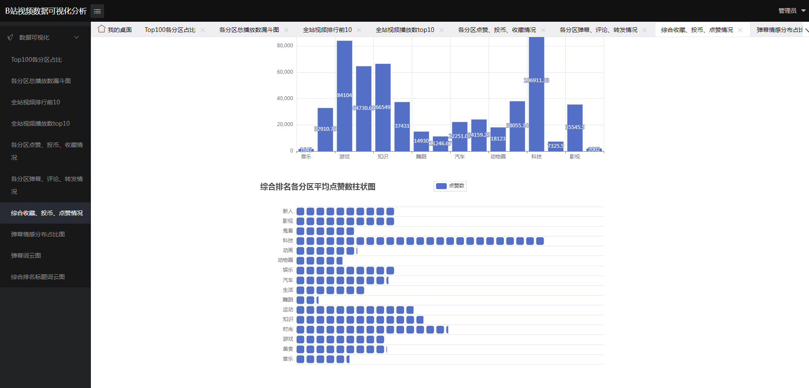
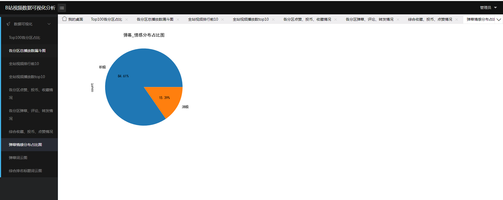
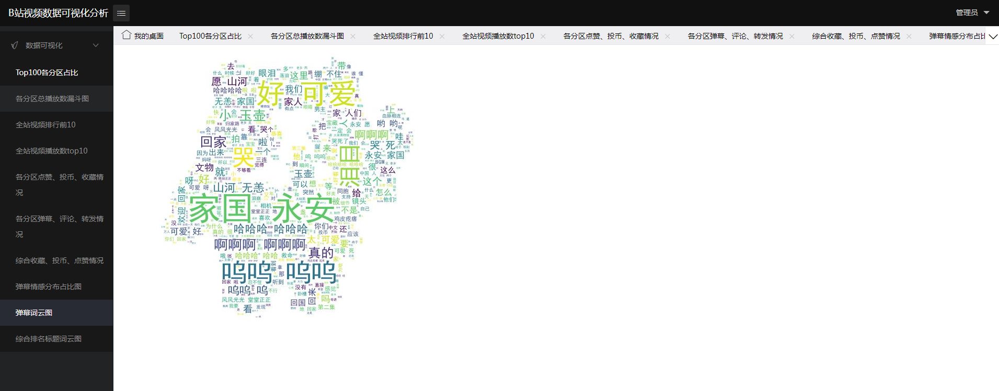
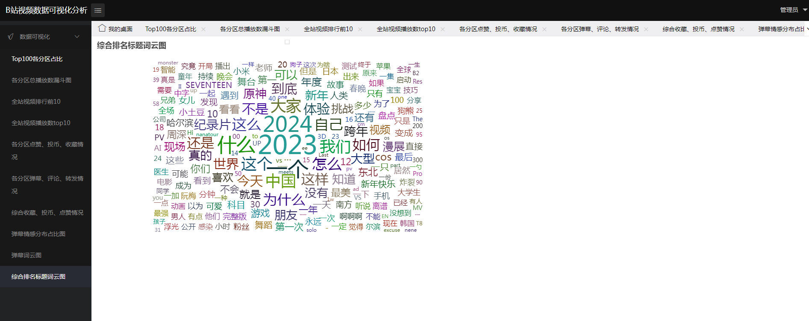
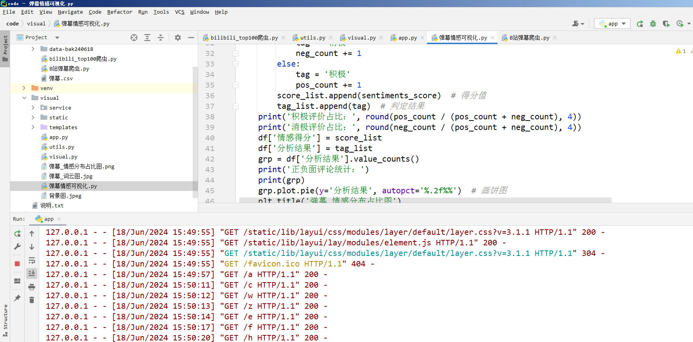

## 开发技术：
毕设介绍
首先安装需要的python库，
安装完之后利用navicat导入数据库文件bili100.sql到mysql中，
再在pycharm编译器中连接mysql数据库，并在设置文件中将密码修改成你的数据库密码。最后运行app.py，打开链接，即可运行。

————

B站爬虫数据分析可视化项目
python爬虫数据分析可视化项目
哔哩哔哩bilibiliTOP100数据并可视化

————

Python爬取哔哩哔哩各分区TOP100排行榜数据，保存到MySQL数据库中，利用PyEcharts库进行可视化。
可视化图表包括:各分区占比饼图、各分区总播放数漏斗图、综合排名标题词云图、各分区点赞投币收藏情况、各分区弹幕评论转发情况和综合收藏投币点赞情况。

————

